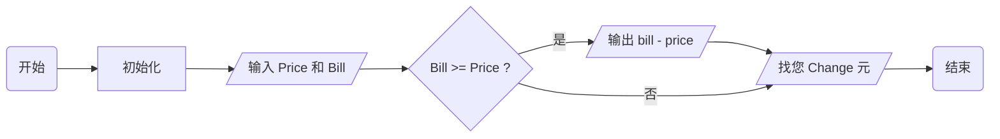
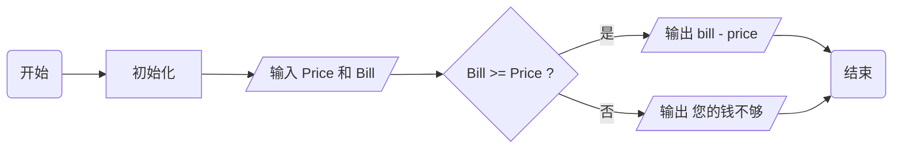

---
{"tags":["翁恺","if","else","关系运算符","比较运算符","运算符","注释","程序员的自我修养","流程图"],"dg-publish":true,"permalink":"/翁恺计算机入门/3.2 第三周第二讲/","dgPassFrontmatter":true,"created":"2024-06-09T11:46:25.878+02:00","updated":"2024-07-18T00:00:05.458+02:00"}
---

## 3.2.1 做判断：if 语句根据条件决定做还是不做

还记得我们在 [[翁恺计算机入门/2.2 第二周第二讲 .\|章节 2.2.1]] 里面做过一个时间差计算器。那个时候我们为了放置一些不优雅的时间格式，我们选择把分钟与小时统一成分钟再慢慢换算。这一次，我们来用一些更高级的方式解决问题（帅气托镜）（眼镜闪光）。
#####  <b style="color: #5DD0C8;">1 - if 语句定义及用处简介</b>
`if` 语句，也叫**判断机制**。我们可以借 `if` 语句设立一个条件，并根据条件是否成立，决定是否执行一件事。

```c
if (  ){

}
```

上面就是一个 `if` 语句的基本结构。大致可以被翻译成：
	如果（圆括号内的条件）**成立**，执行（花括号中的内容）。

当然，如果圆括号的条件内**不成立**，就不执行花括号内的内容。

##### <b style="color: #5DD0C8;">2 - 使用 if 语句的时间差计算器及其解析</b>
上次最让我们困扰的事情就是分钟的借位。会发生 3：20 - 1：40 = 2：-80 的尴尬情况。这次，在专业的 `if` 语句的加持下，尴尬不再！

```c
int Hour1, Minute1;
int Hour2, Minute2;

printf("请输入第一个时间：");
scanf_s("%d %d", &Hour1, &Minute1);

printf("请输入第二个时间：");
scanf_s("%d %d", &Hour2, &Minute2);

int Difference_Hour = Hour1 - Hour2;   
int Difference_Minute = Minute1 - Minute2;
if (Difference_Minute < 0){
	Difference_Minute = 60 + Difference_Minute;
	Difference_Hour = Difference_Hour --;
}

printf("两个时间的时差为%d时%d分。", hourDifference, minuteDifference);
```

这一次我们选择了最无脑的 开始小时 - 结束小时；开始分钟 - 开始分钟 来计算时间差，并在之后使用 `if` 语句来进行补救。以下是 `Difference_Minute` 为负数的情况，被 `if` 语句检测到之后的步骤演示：

-  `Hour1 Minute1 = 3 30` `Hour2 Minute2 = 1 50` 

```c
int Difference_Hour = Hour1 - Hour2;   
	// Difference_Hour = 2

int Difference_Minute = Minute1 - Minute2;
	// Difference_Minute = -20

if (Difference_Minute < 0){
	// 检测到 `Differrence_Minute = -20`，符合 `< 0` 的条件，进行花括号内的步骤
	
	Difference_Minute = 60 + Difference_Minute;
		// 再次给 Difference_Minute 赋值：60 + -20
	
	Difference_Hour = Difference_Hour --;
		// 再次给 Difference_Hour 赋值：2 --（递减）
}
	// 终止花括号
```
<br/>

## 3.2.2 判断的条件：关系运算，做比较的运算符

在上一章中，我们在 `if` 语句中使用了 `<`（小于号）来比较 `Difference_Minute` 是否等于零。除了小于号之外，c 语言中还存在更多用来 “**判断**” 或者 “**比较**” 的符号。我们接下来会看到。

##### <b style="color: #5DD0C8;">1 - 表格：关系运算符 / 比较运算符</b> 
下面是被整合成表格的 c 语言关系运算符：

|                运算符                |                 意义                 |
| :-------------------------------: | :--------------------------------: |
| <div style="width:332px;">></div> | <div style="width:332px;">大于</div> |
|                 <                 |                 小于                 |
|                ==                 |                是否相等                |
|                !=                 |               是否不相等                |
|                >=                 |              是否大于或等于               |
|                <=                 |              是否小于或等于               |

##### <b style="color: #5DD0C8;">2 - 关系运算的值</b> 
它们是运算符，也就是说它们参与的表达式都会有会有 “结果”。

- 关系运算只可能有两个结果：
	→ 当两个值的关系**符合**关系运算符的预期时，结果为 `1` 。
	→ 当两个值关系**不符合**关系运算符的预期时，结果为 `0` 。

这可以被下方的代码论证：

```c
printf("%d\n", 5 == 3);
printf("%d\n", 5 > 3);
printf("%d\n", 5 <= 3);
```

```
0
1
0
```

##### <b style="color: #5DD0C8;">3 - 表格：运算符优先级 2.0 版本</b> 

一表以蔽之：

|                优先级                |                运算符                |                  运算                  |                 结合关系                 |                  举例                  |
| :-------------------------------: | :-------------------------------: | :----------------------------------: | :----------------------------------: | :----------------------------------: |
| <div style="width:120px;">1</div> | <div style="width:120px;">+</div> | <div style="width:120px;">单目不变</div> | <div style="width:120px;">自右向左</div> | <div style="width:120px;">a*+b</div> |
|                 1                 |                 -                 |                 单目取负                 |                 自右向左                 |                 a*-b                 |
|                 2                 |                \*                 |                  乘                   |                 自左向右                 |                 a\*b                 |
|                 2                 |                 /                 |                  除                   |                 自左向右                 |                 a/b                  |
|                 2                 |                 %                 |                  取余                  |                 自左向右                 |                 a%b                  |
|                 3                 |                 +                 |                  加                   |                 自左向右                 |                 a+b                  |
|                 3                 |                 -                 |                  减                   |                 自左向右                 |                 a-b                  |
|                 4                 |                 >                 |                  大于                  |                  /                   |                  /                   |
|                 4                 |                 <                 |                  小于                  |                  /                   |                  /                   |
|                 5                 |                ==                 |                 是否等于                 |                  /                   |                  /                   |
|                 5                 |                !=                 |                是否不等于                 |                  /                   |                  /                   |
|                 5                 |                >=                 |                是否大于等于                |                  /                   |                  /                   |
|                 5                 |                <=                 |                是否小于等于                |                  /                   |                  /                   |
|                 6                 |                 =                 |                  赋值                  |                 自右向左                 |                 a=b                  |

- 一些好玩的例子

	7 >= 3 + 4
	在这个例子中，因为正常运算的优先级比关系运算符要高，所以 3+4 会被优先计算，最后判断 7 是否大于或等于 3+4。这个例子中的是一例成立的关系，所以结果为 1。
	
	5 > 3 == 6 > 4
	在这个例子中，因为大于/小于的优先级比双等于高，所以大于/小于的表达式会被优先计算。之后，表达式演算为 1 == 1，关系成立，结果为 1。
<br/>

## 3.2.3 收银计算器：判断，注释，流程图

还记得我们在 [[翁恺计算机入门/2.1 第二周第一讲\|2.1 第二周第一讲]] 中做过一个满是缺陷的收银计算器。现在，我们会对它进行一个升级。主要的目标是让它达成三个目标：

1. 不再写出找您负三块钱这类语句。   2. 让它分辨客人给的钱够不够。  3. 让代码更容易被阅读。

##### <b style="color: #5DD0C8;">1 - 一个更好的找零计算器</b> 

```c
//初始化
int price = 0;
int bill = 0;

//读入价格与金额
printf("请输入商品票面：");
scanf_s("%d", &price);
printf("请输入付款价格：");
scanf_s("%d", &bill);

//计算找零
int change = 0;
change = bill - price;

//判断条件
if (bill >= price) {
	printf("找您 %d 元", change);
}

//输出
printf("你的钱不够。");
```
我们可以看见，出现了一些我们从没见过的东西。

##### <b style="color: #5DD0C8;">2 - 注释（Comment)</b>
上方代码块中有一些以双斜杠开头，后面跟着一些内容的行（`//初始化`）。这些代码被称为注释。它们对程序的功能不会有任何影响，只是让编写者往代码块中提供一些信息，以便阅读者更容易理解程序。

存在两种注释的格式，它们也都有独特的功能：

- 双斜杠注释 (`// ABCDEFG`)
	这种注释的区域为：双斜杠到这一行的结束。
	这种注释的格式只能自定义它的开头，但不能自定义它的结尾（注释的开头是双斜杠之后，注释的结尾就是这一行的结尾）。

- 斜杠星号注释（`/* ABCDEFG */`)
	这种注释的区域为：从 `/*` 到 `*/` 之间的所有内容。
	这种注释的格式要自由得多，它可以跨行，也可以自定义开头和结尾的位置。

##### <b style="color: #5DD0C8;">3 - 流程图</b>

上方的图表就是流程图：
	- **圆角矩形**表示开始或结束
	- **直角矩形**表示做的事情
	- **平行四边形**表示输入或输出
	- **菱形**表示判断
	- 还可以在箭头中途加上一些 **Tag**
<br/>

## 3.2.4 否则的话：如果条件不成立呢？

##### <b style="color: #5DD0C8;">1 - 实际上，之前的计算器也没那么好</b> 
好吧，老实说我们上面的代码还是有些问题的：

- 如果我们输入的 `票面` = 50，`价格` = 60，终端输出将会如下：
```
您的钱不够。
```

- 但当 `票面` = 100，`价格` = 60，终端输出将会如下：
```
找您 40 元。
您的钱不够。
```

啊这

问题就在这里，如果 `票面` > `金额` 的时候就会出现矛盾。为了解决这个矛盾，我们需要往程序中加入更多的判断，以让这句 “您的钱不够” 可以在它该出现的地方出现。

##### <b style="color: #5DD0C8;">2 - 一个更好更好的计算器 / 初识 else 语句</b> 
我们可以在 `if` 语句后面跟上 `else` 语句来让这个计算器变得更好更好。不过在使用它之前，先让我们来初步认识一下它。

###### <b style="color: #5DD0C8;">2.1 - 初识 else 语句：基础结构与定义</b> 
目前来看，`else`语句是和`if`语句绑定使用的。它用于囊括除了`if`语句中的条件的所有情况。以下是它的基础结构：

```c
if(  ){

}else{

}
```

`else`语句被嵌在`if`语句之后，和`if`一样，拥有一个附属于它的花括号，但**没有**制定条件用的圆括号。

如果`if`语句被翻译成：
	如果（`if`圆括号内的条件）**成立**，执行（`if`花括号中的程序）。

那么`else`语句就可以被翻译成：
	否则的话，执行（`else`行花括号内的程序）。
	如果（`if`圆括号内的条件）**不成立**，执行（`else`行花括号内的程序）。

###### <b style="color: #5DD0C8;">2.2 - 更好更好计算器的建造</b> 
知道 `else` 语句的用处后，更好更好计算器就昭然若揭了：

```c
int price = 0;
int bill = 0;

printf("请输入商品票面：");
scanf_s("%d", &price);
printf("请输入付款价格：");
scanf_s("%d", &bill);

int change = 0;
change = bill - price;

if (bill >= price) {
	printf("找您 %d 元", change);
}else{
	printf("你的钱不够。");
}
```

流程图变为：


完美（兰花指）。


##### <b style="color: #5DD0C8;">3 - else 的应用 - 数字大小比较器</b> 
老师又给我们布置了个作业：我们需要让人输入两个数字，然后我们通过编程以判断出那个大的数，最后再输出它。

```c
	int N1 = 0;
	int N2 = 0;
	scanf_s("%d %d", &N1, &N2);
	
	int Max = 0;
	if (N1 > N2) {
		Max = N1;
	}
	else {
		Max = N2;
	}
	
	printf("Max = %d", Max);
```

这就是咱的第一版编程，我们让先让电脑判断第一个数**是否大于**第二个数，若<u>条件成立</u>，将第一个数赋值给 `Max`变量；<u>否则的话</u>（第一个数小于或等于第二个数），将第二个数赋值给 `Max`变量。

很好，符合要求、可以运行。不过，在研究一段时间后，我们又研究出了第二版：

```c
int N1 = 0;
	int N2 = 0;
	scanf_s("%d %d", &N1, &N2);
	
	int Max = N2;
	if (N1 > N2){
		Max = N1;
	}
	
	printf("Max = %d", Max);
```

这一版要简洁得多。但是……好像……也要更难读懂一些。这版不像上一版一样，一眼看下来就能摸清我的思路，反倒还需要读者去想一想。

###### <b style="color: #5DD0C8;">3.1 - 程序员的自我修养：极致简洁还是简单易懂？</b> 
老师说这是没有答案的。阅读者和角度的不同都可能带来不一样的答案。毕竟能让所有人都能读懂你写的代码也是特别困难的一件事，让电脑省力可能让你的读者们省力不能。
<br/>

## 3.2.5 if 语句再探：if 和 else 后面也可以不跟 {} 而是语句

虽然我们之前在`if`和`else`的基础结构展示中都带着花括号，但实际上，不跟花括号也是可以的（不过`if`语句中用来建立条件的圆括号还是必须得有的！！）。

```c
if (a > b)
	b = Max;
else 
	a = Max;
printf("你好");
```

- 当`if`与`else`语句后方不跟花括号时，会有些新的规则出现（如上）。在这种没有花括号的情况下，`if`与`else`语句：

	- 后方的语句需要被**缩进**。
	- 后方的语句需要跟着 `;` 以代表语句的结束。
	- 后方只能跟着**一句**语句（像最后的那个`printf`语句就不会被包含在`else`语句中了。）。

特别注意：`if`或`else`语句自己的那一行不可以跟着 `;`。


