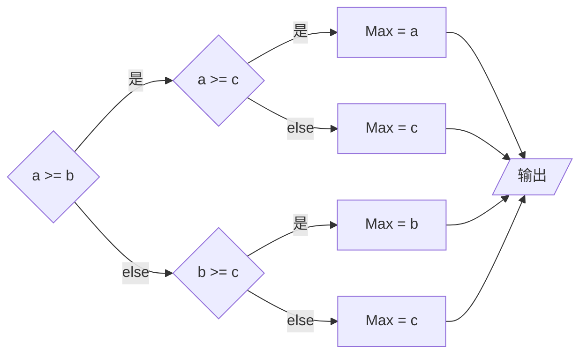

---
{"tags":null,"dg-publish":true,"permalink":"/翁恺计算机入门/3.3 第三周第三讲/","dgPassFrontmatter":true,"created":"2024-06-27T17:40:05.852+02:00","updated":"2024-07-13T23:12:39.275+02:00"}
---

## 3.3.1 嵌套的 if-else：在 if 或 else 后面要执行的还是 if 语句

#####  <b style="color: #5DD0C8;">1 - 例子 针对三个值的大小数比较器</b>
在上一讲的末尾，我们做过一个针对两个值的大小数比较器。现在，我们稍微进阶一下，做个针对三个值的大小数比较器。

还记得翁恺老师在最开始最开始的时候讲的：我们不能告诉计算机 “做什么”，而是要告诉它 “怎么做”。所以，我们不能让编译器做什么 “一眼看出来谁大谁小” 啊什么的，而是要帮它**一步一步**地计算出这个目标。

假设三个数 `a` `b` `c`，分别对应着 4、5、6。那么，这个一步步编译的流程大概如下：


<font size=2>在这种情况下，右下角的 else 线其实可以省略，但为了思维的完整性我还是写上了。</font>

可以看到，我们将要做的是一个带有**层级**的判断。这个流程图如果用代码呈现的话就是下面那样：

```c
int a,b,c;
scanf_s("%d %d $d", &a, &b, &c);

int Max;
if (a >= b) {
	if (a >= c) {
		Max = a;
	} 
	else {
		Max = c;
} 
else {
	if (b >= c) {
		Max = b;
	}
}

printf("最大的数是：%d", Max);
```
<font size=2>这个是老师的版本，我的没做流程图硬写的但是带注释的版本参见脚注。</font>^[1]

#####  <b style="color: #5DD0C8;">2 - if - else 嵌套</b>
在上方的编译中，我们发现了一个很新的结构：

```c
if (a >= b) {
	if (a >= c) {
		Max = a;
	} 
	else {
		Max = c;
} 
else {

}
```

像这种层层递进的，由 if-else 语句组合成的，**一个条件套一个条件（条件之间有依赖性）、形成多个层次** 的被称为 “**嵌套语句**”。

#####  <b style="color: #5DD0C8;">3 - 程序员的自我修养：嵌套中的花括号</b>
话说，之前的计算器代码实际上也能以下方的样貌呈现：

```c
int a,b,c;
scanf_s("%d %d $d", &a, &b, &c);

int Max;
if (a >= b) 
	if (a >= c) 
		Max = a; 
	else 
		Max = c;

else 
	if (b >= c) 
		Max = b;

printf("最大的数是：%d", Max);
```

妈呀，两眼一亮，好简洁！这就是咱在上一章说过的 “省略花括号” ！

不过，这么做的风险其实很大。因为`else`语句还有一个让人头痛的机制我们没讲：
	**`else`会和最近一行的`if`去匹配。**
	**花括号可以让`else`的匹配更加精准。**

让我们用一系列例子来理解它：

```c
if (a >= b) 
	if (a >= c) 
		Max = a; 
	else 
		Max = c;
```
<font size=2>此时，里 else 最近的 if 是那个里面的 if</font>

```c
if (a >= b) {
	if (a >= c) 
		Max = a; 
	} else 
		Max = c;
```
<font size=2>在花括号的阻隔后，else 改为去匹配那个外面的 if</font>

```c
if (a >= b) 
	if (a >= c) 
		Max = a; 
else 
	Max = c;
```
<font size=2>即使 else 与外面的 if 有着相同缩进级别，但它匹配的还是里面的那个 else</font>

众所周知，一名头秃秃的（划掉）优良的程序员应该做到三点：让自己懂、让计算机懂、让读者懂。只有把程序写的足够明了、少用高风险的编译格式才能让程序更加易懂。让我们三个过上幸福美满的日子。

在这三个例子后，我们总结出来三个点：
	1. 	**`else`会和最近一行的`if`去匹配。**
	2.     **花括号可以让`else`的匹配更加精准。**
	3.     **`else`的匹配机制不受缩进级别的影响。**

**所以，作为程序员的自我修养，我们应该在嵌套式加上花括号，不要省略。**
<br/>

## 3.3.2 级联的 if-else

现在，我们来学`if-else`语句的另一种玩法。让咱通过代码式地呈现一个 “分段函数” 来理解吧。

#####  <b style="color: #5DD0C8;">1 - 例子 分段函数的代码式呈现</b>
我们需要呈现的分段函数是这个：

f( x ) = -1, si x < 0
f( x ) = 0, si x = 0
f( x ) = 2x, si x > 0

```c
int x = 0;
int sol = 0;

scanf_s("%d", &x);

if (x < 0) {
	sol = -1;
}
else if (x == 0) {
	sol = 0;
}
else {
	sol = 2 * x;
}

printf("sol = %d", sol);
```

#####  <b style="color: #5DD0C8;">2 - if - else if 级联</b>
我们可以发现上方的要求和代码都有些不一样了（相对于嵌套语句而言）。

- 使用嵌套语句的情况下，我们遇到的条件一般都有多个层次，也有依赖性
	（如果 aaa 成立的话，bbb 成立吗？如果 bbb 不成立就去看 ccc 成立吗？ aaa 不成立的话就去看 ddd 成立吗？ ）

- 而我们现在使用的 “**级联语句**” 的条件之间并没有依赖性，而是**单一层次**的。条件之间也没有依赖性，反倒是**相互排斥**的
	（aaa 成立吗？不成立的话 bbb 成立吗？还不成立的话 ccc 成立吗？）。

级联语句方便我们依次检查相同层级下的条件。基础格式如下：
```c
if ( ) {
	
}
else if ( ) {
	
}
else{
	
}
```
<font size=2>通常最后都会跟着一个不跟着 if 的 else</font>

#####  <b style="color: #5DD0C8;">3 - if - else if 级联的由来</b>
实际上，`if - else if`语句是一种特殊的 `if - else`嵌套。比如上方的基础格式可以以下面的方式用`if - else`嵌套展现：

```c
if ( ) {
	
}
else {
	if ( ) {
		
	}
	else {
		
	}

```

不过嘛，这种代码也太难看了。如果嵌套得再多些，代码就会往右下方的方向持续生长，很突兀；同时，多层的嵌套也带来了极高的阅读难度。所以，人们开发出了一个更加美观的编译方法，`if -else if` 级联就这么出世了。

#####  <b style="color: #5DD0C8;">4 - 程序员的自我修养：单一出口</b>
让我们做个选择：

选项一：
```c
if (x < 0) {
	sol = -1;
}
else if (x == 0) {
	sol = 0;
}
else {
	sol = 2 * x;
}

printf("sol = %d", sol);
```

选项二：
```c
if (x < 0) {
	printf("sol = -1");
}
else if (x == 0) {
	printf("sol = 0");
}
else {
	printf("sol = %d", 2 * x);
}
```

这两段代码做的都是几乎相同的事情。哪个要更接近一个优雅程序员的所作所为？
	是选项 1 。

让我们来比较一下。第一个选项做的是计算出`sol`的值，在最后才输出；而第二个选项做的是当有一个选项被确定时直接输出。翁恺老师觉得第一种选项比较好。

翁恺老师说，第一个选项的程序做的事情少。在计算完结果之后，我们还可以**更自由**地做其它更改，也可以把那个变量交给更多的**可能会有**的运算。

而第二种就直接把程序**写死了**，它只能做输出。
<br/>

## 3.3.4 多路分支：switch - case 语句

这一章的主要目标是认识一个新的语句类型：**switch - case**。

#####  <b style="color: #5DD0C8;">1 - 例子 星期的数字 - 英文转换器</b>
让我们先来做一道题：**从终端输入一个值，并根据这个值来输出相应的东西。** 例：输入 1 对应 Monday，输入 2 对应 Tuesday……

利用上我们之前学的 `if - else if`语句，我们可以写出下方的代码（忽略掉初始化了）：
```c
if (Num == 1) {
	printf("Monday");
}
else if (Num == 2) {
	printf("Tuesday");
}
else if (Num ==3) {
	printf("Wednesday");
}
else {
	printf("果咩纳塞 我只编译了周一到周三");
}
```

这段代码确实可以执行任务，不过执行方法会比较麻烦。假设`Num`是 3 的话：
	1. 计算机开始检查第一个`if`，发现`Num`= 3 ≠ 1，跳到大括号尾继续执行。
	2. 计算机开始检查`else if`，发现`Num` = 3 ≠ 2，跳到大括号尾继续执行。
	3. 计算机开始检查第二个`else if`，发现`Num` = 3 = 3，输出 Wednesday。
	4. 结束

这很麻烦。而且如果`Num` = 4 的话，步骤就更多了。

但是如果我们运用我们小学二年级就学过的`switch - case`语句的话，代码会是这样：
```c
switch (Num) {
case 1:
	printf("Monday");
	break;
case 2:
	printf("Tuesday");
	break;
case 3:
	printf("Wednesday");
	break;
default:
	printf("果咩纳塞 我只编译了周一到周三");
	break;
}
```

虽然长度长了一些，但是电脑会省很多力。假设`Num`是 3 的话，过程如下：
	1. 电脑跳到`case 3`，输出 Wednesday。
	2. 结束

超快！而且就算有 10086 个`case`，电脑依然只需要做两步！

#####  <b style="color: #5DD0C8;">2 - switch - case 语句</b>
下方就是`switch - case`语句的基本结构：
```c
switch ( 控制表达式 ) {
case 常量:
	语句
	更多语句
case 常量:
	语句
	更多语句
default:
	语句
	更多语句
}
```

###### <b style="color: #5DD0C8;">2.1 - 控制表达式相关</b> 
首先，`switch`后方圆括号内的控制表达式**只能是整数类型**的（`int`类型变量 / 整数结果的表达式 / 整数）。
	如果圆括号中的是一个`double`类型的变量，程序会直接报错。

###### <b style="color: #5DD0C8;">2.2 - 常量相关</b> 
在`case`语句后方的常量，它可以是个常数（数字）也可以是常熟计算的表达式。
	就是说那个位置不仅可以**填数字**，还能**填赋值过了的标识符**（变量名），也可以**填运算**。

###### <b style="color: #5DD0C8;">2.3 - 语句机制相关 / break 相关</b> 
在`switch - case`语句中，计算机读取控制表达式后，会直接跳转到相应的`case`上。它会从哪一个`case`开始运行，并在遇到`break`后脱离这整段语句。
	如果计算机在执行完一整个`case`后并没有遇到`break`，它会继续执行下一个`case`可以执行的语句，直到遇到`break`为止。我们将用一段代码来说明这个机制。假设`Num` = 1：

```c
switch (Num) {
case 1:
	printf("Monday\n");
case 2:
	printf("Tuesday");
break;
```
```
Monday
Tuesday
```
步骤如下：
	1. 跳转至`case 1`，输出`Monday`。
	（此时`case 1`已经执行完毕，但因为还没碰到`break`，继续在语句内运行）
	2. 输出`Tuesday`
	3. 遇到`Break`，退出语句。

我们可以把`switch - case`当成一个公交车，把`case`当作站牌，再把`break`当作下车地点。我在`case`上车，只要不到下车地点，我当然可以经过很多站牌。

不过嘛，我们一般写代码都会给每一个`case`配一个`break`就是了。


***
^[1] 
```c
//初始化
int a = 0;
int b = 0;
int c = 0;
int Max = 0;

//录入
scanf_s("%d %d %d", &a, &b, &c);

//程序 - 假设最大的是 a
if (a >= b) {
	if (a >= c) {
		Max = a;
	}
}

//程序 - 假设最大的是 b。不然的话，最大的必定是 c
if (b >= a) {
	if (b >= c) {
		Max = b;
	}
	else {
		Max = c;
	}
}

printf("最大的数是%d\n", Max);
```
