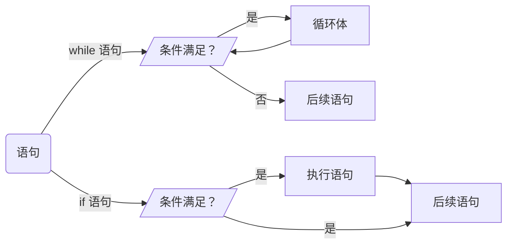

---
{"tags":["翁恺"],"dg-publish":true,"permalink":"/翁恺计算机入门/4.1 第四周第一讲/","dgPassFrontmatter":true,"created":"2024-07-08T22:38:47.839+02:00","updated":"2024-07-13T23:13:03.674+02:00"}
---

## 4.1.1 循环：有些事情就得用循环才能解决

#####  <b style="color: #5DD0C8;">1 - 位数计数器</b>
我们想要写个程序，让电脑帮忙识别一个多位数究竟有几位。不过呢，因为电脑不能和人类一样 “一眼看出来” 那个数字有多少位，所以我们需要用一个**更数学**的角度去分析 “数数” 这个动作。

- 方法1：
	我们知道数字的位数代表着一个区间，一位数代表着 1 - 9、两位数代表着 10 - 99、三位数代表着 100 - 999…… 
	我！懂！了！

```c
	// Number 为输入的数字；Digit 为数字的位数。
	
	scanf_s("%d", &Number);

	if (Number > 999) {
		Digit = 4 ;
	}
	else if (Number > 99) {
		Digit = 3;
	}
	else if (Number > 9) {
		Digit = 2;
	}
	else {
		Digit = 1;
	}
```
<font size=2>（实际上这不算正确答案，别信 QwQ）</font>

#####  <b style="color: #5DD0C8;">2 - 深扒：编写 if 与 else if 语句时的坏习惯</b>
拿上面的代码块举例，我们来研究研究一些对`else`语句和`else if`语句的误解、区别，以及一些在编写他们时的坏习惯。

###### <b style="color: #5DD0C8;">2.1 - if 与 else if 的根本区别</b> 

`if`和`else if`语句在一些时候可以相互调换，但它们之间还是有着不小的区别的。比如，如果把上面的程序写成：
```c
if (Number > 999) {
	Digit = 4 ;
}
if (Number > 99) {
	Digit = 3;
}
if (Number > 9) {
	Digit = 2;
}
if (Number > 0) {
	Digit = 1;
}
```

这样，在输入 1213 之类的数的话，计算机一步一步做下来，会这么想：
```c
if (Number > 999) {
	Digit = 4 ;
}
// 数字确实小于999，将4赋值给Digit。

if (Number > 99) {
	Digit = 3;
}
//数字确实大于99，将3赋值给Digit。

……
```

最后，程序会说 1213 这个数是一个 1 位数。

（摊手）。

###### <b style="color: #5DD0C8;">2.2 - else if 级联先后顺序的重要性</b> 
计数器的代码还有一个很重要的注意事项，我们可能没注意到。我们需要稍稍改变一下代码以了解它：
```c
if (Number > 0) {
	Digit = 1 ;
}
else if (Number > 9) {
	Digit = 2;
}
else if (Number > 99) {
	Digit = 3;
}
else {
	Digit = 4;
}
```

我们更改了条件的先后顺序：之前的条件是从大判断到小（9999 → 999 → 99 → 9 → 0），现在是从小判断到大。

程序是不能这么交换的。因为在`else if`语句中，一旦满足条件，程序就会跳出级联。如果输入的是个四位数，在刚进入级联时就符合条件，然后会直接跳出级联。

总而言之，`else if`语句需要的是 “**从不成立的条件开始筛选，直到条件成立**”，而不是 “从成立的条件筛选，直到条件不成立”。

#####  <b style="color: #5DD0C8;">3 - 初识 while 语句：一个更好的位数计算器</b>
话说回来，之前的位数计算器只能在输入数的位数偏小的时候使用。如果位数一大，级联就会被盖得很高很高很高……

作为一个优雅的程序员，我们不允许这种事情发生！现在是程序优（重）化（写）时刻！

我们再来扒一扒 “数数” 这件事的底层逻辑，人类无非是数一位数划掉一位数再数一位数划掉一位数，如此循环往复。我们也可以让计算机干这个：

- 我们可以让输入的数字除以十（这就相当于从数的最右一位向左划），循环往复，直到没有数可以划掉为止。同时，每划掉一位数，我们就往`Digit`变量上加一。

```c
if (Number > 0) {
	Digit++;
	Number = Number / 10;
	if (Number > 0) {
		Digit++;
		Number = Number / 10;
		if ……
	}
}
```
大概就是这样！

……不对，我们好像踏入了另一个没完没了的东西。我们需要一种手段，让程序自己可以重复执行，直到条件的达成。这，就是`while`语句！

```c
Digit++;
Number = Number / 10;
while (Number > 0) {
	Digit++;
	Number = Number / 10;
}
```

简洁、优雅。

（摇晃红酒杯）（痛饮一口其中提神用的能量饮料）（被呛到）（狼狈收场）（继续工作）

###### <b style="color: #5DD0C8;">3.1 - while 语句的基本逻辑</b> 
我们可以拿上方的代码块来讲解基本逻辑。假设 `Number` = 13：
```c
while (Number > 0) {                     // 查看条件，发现条件不成立，进入循环体。
	Digit++;                             // 将 Digit +1    (Digit = 1, Number = 13)
	Number = Number / 10;                // 将 Number / 10 (Digit = 1, Number = 3)
	//                                   // 回到 while，再次检查是否符合条件。
	//                                   // 发现条件成立，循环开始
}
```
```c
while (Number > 0) {                     
	Digit++;                             // 将 Digit +1    (Digit = 2, Number = 3)
	Number = Number / 10;                // 将 Number / 10 (Digit = 2, Number = 0)
	//                                   // 回到 while，再次检查是否符合条件。
	//                                   // 发现条件不成立了，跳出语句。
}
```

- 所以：
	如果括号内的条件**成立**，`while`语句会**执行**（循环）。
	如果括号内的条件不成立，`while`语句不会执行（或者结束循环）。

由此，我们可以说，`while`语句和`if`语句是一模一样的逻辑。唯一的区别就是`while`语句会第二次检查条件，而`if`语句是一遍过的。
<br/>

## 4.1.2 while 循环：和 if 一样，条件满足就不断执行后面的语句

#####  <b style="color: #5DD0C8;">1 - 深入：while 语句</b>
######  <b style="color: #5DD0C8;">1.1 - while 语句与 if 语句的区别</b>
我们可以说，`while`语句和`if`语句是一模一样的结构与逻辑。唯一的区别就是：
- `while`语句会反复检查条件。
- `if`语句是一次性的。

让我们用流程图来进行更清晰的展示：

<font size=2>循环体就是 while 语句中大括号的内容，也就是如果条件成立的话会反复执行的部分。</font>
<font size=2>但人们并没有给 if 语句大括号的内容起名字 :(</font>

我们看到：
	- 当`while`语句大括号的内容被执行完毕的时候，它首先会返回到判断条件，查看现在的条件是否成立。若依然成立，再次执行循环体。
	- 当`if`语句大括号的内容被执行完毕的时候，直接跳出。

######  <b style="color: #5DD0C8;">1.2 - 循环体内必须得有能改变条件的机会。否则，死循环</b>
就和标题一样，`while`循环里必须得有能改变语句圆括号内的 "条件“ 的机会。我们拿一个反面例子来做个实验：

```c
while (Number > 0) {
	Digit++;
}

printf("Change the world");
```

在这个例子中，循环体里面没有任何能改变 ”条件“ 内变量的因素，所以一旦条件成立，`Digit`变量会被无限+1，直到程序被编译器鲨掉为止；同时，因为条件永远不会被达成，程序就只能被困在循环体中，之后的`printf`语句也将永不见天日。

换言之，**一个程序可以做到在语法正确的同时，在逻辑上有错误。我们不能以为程序通过编译了，程序就正确了。

如果我们往 PTA 里面塞了一个死循环，会跳出 ”超时“ 的提醒。因为程序会一直运行到被裁判软件鲨掉。

######  <b style="color: #5DD0C8;">1.3 - while 语句的定义</b>
我们一般会把`while`语句翻译成 ”**当**“。一整个`while`循环的翻译就是 ”**当……成立，重复循环体内的语句**“。

#####  <b style="color: #5DD0C8;">2 - 位数计算器解析，以及，捉虫小技巧</b>
让我们把最开始的位数计算器代码块搬回来：
```c
Digit++;                                      // 这一行。
Number = Number / 10;                         // 和这一行。
while (Number > 0) {
	Digit++;
	Number = Number / 10;
}
``````

我从一开始就好疑惑这两行的作用，总感觉不加它们也可以？害，要不怎么说翁恺老师是翁恺老师呢，他就好像我肚子里的蛔虫（没有侮辱的意思）一样了解我啊（叉腰）。

让我们来测试一下如果没有那两行，程序会不会出什么问题。

######  <b style="color: #5DD0C8;">2.1 - 捉虫小技巧</b>
但翁恺老师深得授人以鱼不如授人以渔的道理，准备先教我们一些捉虫的小方法。

- **捉虫小技巧 1：纸算**
	这个方法就是让我们在纸上，用人脑**一步一步的演算**以模拟电脑。从左往右，**在每一次循环过后，记载每一个变量的改变**。
	假设`Number` = 213，过程与方法大致如下：

```c                                          
Digit++;                                      
Number = Number / 10;                         
while (Number > 0) {                          
	Digit++;
	Number = Number / 10;                     
}
``````
```
Digital            0          1          2          3 
Number             213        21         2          0
```

- **捉虫小技巧 2：多次且刁钻的验算**
	如果只是测试一个数的话，这肯定是不准确的。我们应该进行**更多次且尽量不同的、刁钻的测试**。一般来说，这些数会是：
		- 每一个位数的变量（从个位到上限位都测一遍）；
		- 有效范围两端的数据；
		- 极限数据；
		- 特殊的倍数（比如说 10）；
		- 0；
		- 负数。

将那么多刁钻的可能性都进行一次纸面演算，程序就无敌了。

- **捉虫小技巧 3：在输出时阶段性的输出变量**
	这个小技巧可以让我们少进行一些纸算法，让程序自己乖乖的输出变量在每个阶段的变化：

```c
while (Number > 0) {    
	printf("Number = %d Digit = %d\n", Number, Digit);
	Digit++;
	Number = Number / 10;                     
}
```
```
Number = 1213 Digit = 0
Number = 121 Digit = 1
Number = 12 Digit = 2
Number = 1 Digit = 3
4
```

我们已经无敌（推墨镜）。

######  <b style="color: #5DD0C8;">2.2 - 计数器解析</b>
在一个个试完前面的尝试后，我们发现，当测试值是 0 的话，如果没有那两行代码，输出会显示 0 是个 0 位数，这是错误的。但在加了那两行之后，问题解除。

当然解决问题的方法也不止这种就是了：

```c
if (Number == 0) {
	Digit = 1;
}
else {
	while (Number > 0) {
		Digit++;
		Number = Number / 10;
	}
}
```
这样也能起到一样的效果。
<br/>

## 4.1.3 do-while 循环：不管三七二十一，先做循环内的句子

#####  <b style="color: #5DD0C8;">1 - 更好的位数计算器流程分析</b>
我们来回顾一下那个位数计算器。探讨一下它的流程：

```c
Digit++;
Number /= 10;

while (Number > 0) {    
	Digit++;
	Number /= 10;                     
}
```

- 流程大致如下：
	1. 将`Number`除十。
	2. 将`Digit`加一。
	3. 检测：条件是否成立。
		3.1 检测：若条件成立，做`Number`除十、`Digit`加一。
		3.2 检测：若条件不成立，跳出语句。

#####  <b style="color: #5DD0C8;">2 - 初识 do-while 语句</b>
这么一看，我们这个语句的逻辑是 先检测、再做事。那有没有一种语句是先做事，再检测是否需要多做一遍呢？

是有的，这就是`do-while`循环。它的基本结构如下：

```c
do {
	<循环体>
} While ( <条件> );
```

在进入`do-while`语句时，第一件事是执行一遍循环体（而不是检测条件）。在执行结束的时候才开始第一次检测。如果`while`语句的条件成立，就再做一遍循环体。如此反复。

- 总而言之，区别大致在于：
	`while`语句中，程序在进入语句后，**第一步是检测**，之后**再决定**执行/不执行循环体。
	`do-while`语句中，程序在进入语句后，**第一步是执行**，之后**再检测**，**再决定**执行/不执行循环体。

- 也在于：
	`while`语句**可能完全不会执行**循环体
	`do-while`语句**一定会执行**循环体，至少一次。

最后，**重要重要很重要**！`while ( <条件> );` 的一行是**用分号结尾**的！！！

不过要是忘了加分号程序也会报错强制让你纠正就是了 :P

#####  <b style="color: #5DD0C8;">3 - 使用 do-while 语句：一个更更好的位数计算器</b>

```c
do {
	Digit++;
	Number /= 10;
} while (Number > 0);
```

简洁、优雅、无敌（摇晃红酒杯）。


